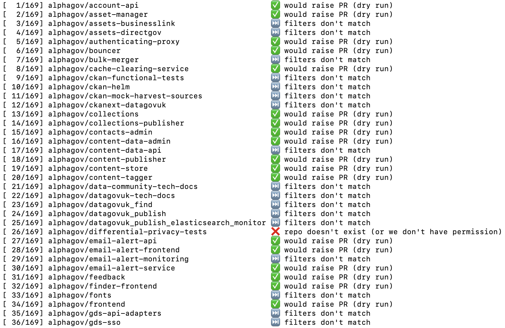

# Bulk Changer

To run RSpec and RuboCop:

`bundle exec rake`

## Commands

### `bulk-update-file`

Ensures that a file exists in every GOV.UK repo, at the given path, with the given contents. If the file does not currently exist, or if its contents do not match the desired contents, then raises a PR to create or update the file.

```
usage: ./bulk-update-file [options]
    -h, --help          print this usage information
    --dry-run           simulate filtering repositories, but do not actually raise pull requests
    --github-token      GitHub API token

    --file-path         path to the file to create/update (required)
    --file-content      desired content of the file (required)

pull request options:
    --branch            name of the branch to commit the change to (required)
    --pr-title          title for the PR to raise (required)
    --pr-description    description of the PR to raise (required)

filtering options:
    --if-any-exist      only raise a PR if any of the given paths exist on the main branch (may be specified multiple times)
    --if-all-exist      only raise a PR if all of the given paths exist on the main branch (may be specified multiple times)
    --unless-any-exist  only raise a PR if any of the given paths do not exist on the main branch (may be specified multiple times)
    --unless-all-exist  only raise a PR if all of the given paths do not exist on the main branch (may be specified multiple times)
```

## Examples

### Create workflows to copy PR template onto Dependabot PRs

Several `alphagov` repositories contain pull request templates, to warn requesters about things like the fact that the repo is continuously deployed, that the repo requires manual pre- or post- merge steps, or that the repo lacks an automated test suite.

The pull requests that Dependabot raises do not use these templates, which has led to issues in the past where reviewers have assumed that a Dependabot PR was safe to merge, when it was not.

To find every GOV.UK repo that contains a pull request template, and automatically raise a PR to add a GitHub Actions workflow[^workflow] that will post the pull request description as a comment on each pull request that Dependabot raises (this requires a GitHub API token with the `workflow` scope):

```bash
./bulk-update-file \
    --dry-run \
    --github-token "..." \
    --branch copy-pr-template-to-dependabot-prs \
    --pr-title "Create workflow to copy PR template onto Dependabot PRs" \
    --pr-description "$(<./templates/copy-pr-template-to-dependabot-prs.pr-description.md)" \
    --file-path ".github/workflows/copy-pr-template-to-dependabot-prs.yaml" \
    --file-content "$(<./templates/copy-pr-template-to-dependabot-prs.yaml)" \
    --if-all-exist ".github/dependabot.yml" \
    --if-any-exist "pull_request_template.md" \
    --if-any-exist "docs/pull_request_template.md" \
    --if-any-exist ".github/pull_request_template.md"
```




[^workflow]: https://github.com/robinjam/dependabot-pr-sync/blob/main/templates/copy-pr-template-to-dependabot-prs.yaml
